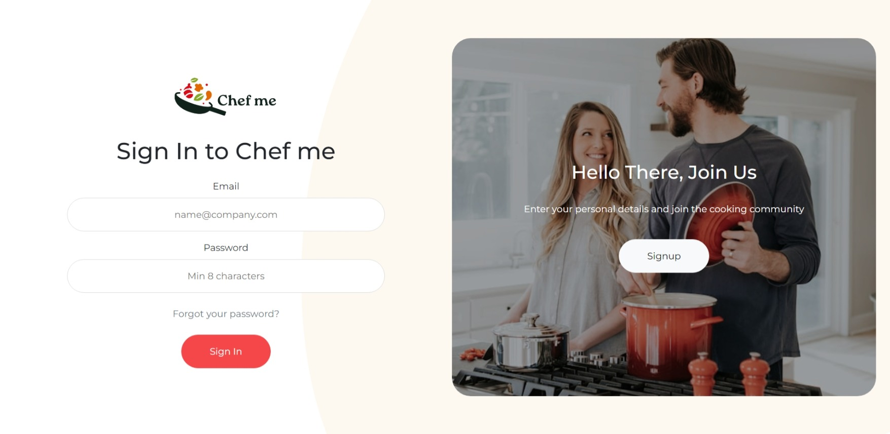

# ChefMe

**ChefMe** is a community-driven website for food lovers to share recipes, culinary tips, and food blogs. With a focus on quality and creativity, ChefMe offers a platform for users to discover and showcase diverse recipes, interact with fellow food enthusiasts, and stay updated with the latest trends in the food industry.


## Table of Contents

- [Features](#features)
- [Screenshots](#screenshots)
- [Installation](#installation)
- [Usage](#usage)
- [Technologies](#technologies)
- [Contributing](#contributing)
- [License](#license)

---

## Features

- **Recipe Sharing**: Users can upload and share their recipes, complete with images, instructions, and ingredients.
- **Food Blogs**: Culinary experts and enthusiasts can share food-related articles, reviews, and tips.
- **User Profiles**: Personalized profiles for users to showcase their favorite recipes and blogs.
- **Commenting & Ratings**: Users can engage with content by leaving comments and ratings on recipes and blogs.
- **Search & Filter**: Advanced search options to find recipes based on ingredients, dietary preferences, cuisine, and difficulty level.
- **Trending Recipes**: Highlights the most popular recipes and blogs to keep users up-to-date.

## Screenshots

### Login && Signup Page 



### Home Page


### Recipe Sharing


### Blog Section


## Installation

1. **Clone the repository**:
   ```bash
   git clone https://github.com/yourusername/chefme.git
   cd chefme
   ```

2. **Move the project to the XAMPP directory**:
   - Copy the project folder to `C:\xampp\htdocs\`.

3. **Start XAMPP**:
   - Open XAMPP Control Panel and start the Apache and MySQL modules.

4. **Database Setup**:
   - Open `phpMyAdmin` by visiting `http://localhost/phpmyadmin`.
   - Create a new database (e.g., `chefme_db`).
   - Import the provided SQL file to set up the necessary tables.

5. **Configure environment settings**:
   - Edit the functions/db.php file with your database details (e.g., database name, username, and password).

6. **Access ChefMe**:
   - Open your browser and go to `http://localhost/chefme`.

## Usage

1. **Sign up** or **Log in** to create your profile.
2. **Share a Recipe**: Upload your recipe details and add an optional blog post for more context.
3. **Explore Content**: Use the search and filter options to discover new recipes and culinary insights.
4. **Engage**: Rate and comment on recipes and blogs to interact with the community.

## Technologies

- **Frontend**: HTML, CSS, JavaScript
- **Backend**: PHP
- **Database**: MySQL (using XAMPP’s MySQL service)

## Contributing

Contributions are welcome! Please follow these steps:

1. Fork the project.
2. Create a feature branch: `git checkout -b feature/your-feature-name`.
3. Commit your changes: `git commit -m 'Add some feature'`.
4. Push to the branch: `git push origin feature/your-feature-name`.
5. Open a pull request.

## License

Distributed under the MIT License. See `LICENSE` for more information.

---

Happy cooking and sharing with **ChefMe**!
